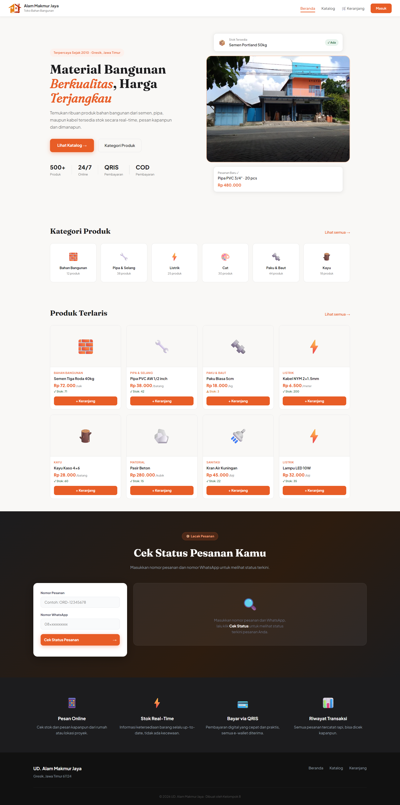

# Sistem Informasi Penjualan UD. Alam Makmur Jaya

Sistem Informasi Penjualan berbasis Web untuk mengelola transaksi, produk, staf, dan laporan penjualan UD. Alam Makmur Jaya.



## Stack Teknologi

- **Frontend**: Vanilla HTML, CSS, JavaScript
- **Backend**: Node.js & Express.js
- **Database**: Flat JSON files (File-based database)
- **Autentikasi**: JWT (JSON Web Token) dan bcryptjs

## Fitur Utama

- **Katalog Produk & Keranjang Belanja**: Pelanggan dapat melihat produk, mengecek stok (mendukung offline/online indicator) dan memesan produk.
- **Checkout & Pembayaran**: Mendukung COD (Cash on Delivery) dan Transfer Bank dengan unggah bukti transfer.
- **Manajemen Pesanan (Admin)**: Konfirmasi pesanan, update status, dan integrasi dengan pengiriman.
- **Verifikasi Pembayaran**: Admin dapat memvalidasi bukti transfer yang diunggah pembeli secara aman (private API).
- **Manajemen Produk & Stok**: Menambahkan produk, mengatur harga pokok, dan fitur restock.
- **Manajemen Piutang**: Pencatatan piutang pelanggan dan pelunasan.
- **Manajemen Pengiriman**: Mencatat kurir, jadwal pengiriman, dan status.
- **Laporan Penjualan**: Laporan harian, bulanan, tahunan dan rentang waktu (WIB/Asia Jakarta Timezone) yang dapat diekspor ke Excel dan PDF.
- **Responsive UI**: Sidebar dengan hamburger menu untuk akses panel admin di perangkat mobile.

## Prasyarat Instalasi

- Node.js (versi 16 atau yang lebih baru direkomendasikan)
- NPM (Node Package Manager)

## Cara Instalasi & Menjalankan

1. Buka folder `backend/`:
   ```bash
   cd backend
   ```
2. Salin `.env.example` ke `.env` (jika belum ada) dan atur variabel environment Anda.
   ```bash
   cp .env.example .env
   ```
3. Install semua dependencies:
   ```bash
   npm install
   ```
4. (Disarankan) Jalankan migrasi/rapikan struktur data yang ada:
   ```bash
   npm run migrate
   ```
5. Jalankan server (backend berjalan di `http://localhost:3000`):
   ```bash
   npm start
   ```
   Atau untuk mode pengembangan:
   ```bash
   npm run dev
   ```
6. Jalankan frontend dengan **Live Server** (VS Code) agar browser tidak memblokir request.
   - Frontend akan memanggil backend otomatis via `window.location.hostname` pada `js/api.js`.
   - Pastikan backend bisa diakses dari browser di host yang sama (biasanya: `http://localhost:3000/api`).

## Menjalankan Pengujian

Jalankan perintah berikut pada direktori `backend/` untuk melakukan test API:

```bash
npm test
```

## Kredensial Default

Gunakan kredensial berikut untuk masuk ke Panel Admin (`pages/login.html`):

- **Email**: `admin@amj.com`
- **Password**: `password123`

_(Sangat disarankan untuk mengubah password ini atau membuat akun staf baru setelah instalasi)._

## Daftar Endpoint API Penting

- `POST /api/public/auth/login`: Autentikasi pengguna dan mengembalikan JWT.
- `GET /api/health`: Health check, mengembalikan status `ok`.
- `GET /api/kasir/transactions`: Riwayat transaksi (Kasir/Staff sesuai role).
- `POST /api/public/checkout`: Memproses checkout (membuat pesanan/ transaksi).
- `GET /api/transactions/:id/bukti-transfer`: Mengunduh / melihat bukti transfer yang sifatnya privat.
- `GET /api/admin/reports/daily`: Laporan harian (Admin).
- `GET /api/admin/products`: Data produk (Admin/Kasir sesuai role/endpoint).

Catatan: pada repo ini, path backend memakai grouping seperti `/api/public/*`, `/api/admin/*`, dan `/api/kasir/*` (lihat `backend/server.js`).

---

Dikembangkan untuk UD. Alam Makmur Jaya.
